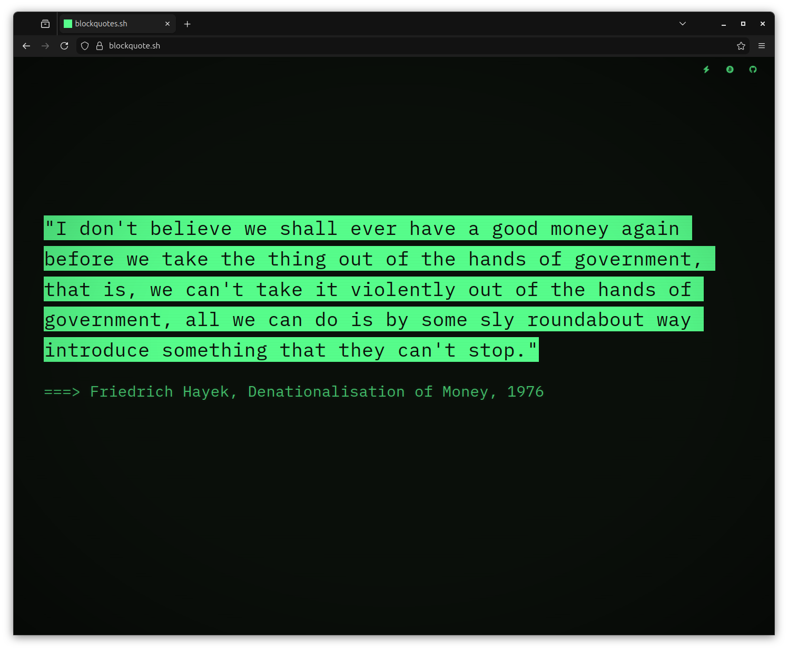

# Blockquotes.sh



Welcome to blockquotes.sh, a webpage showcasing a growing collection of Bitcoin and Bitcoin-related quotes. Share your favourite quotes, and contribute your own to keep it growing.

## 🎮 Controls

### Desktop (Keyboard Shortcuts)

- **`Space`** — Pause/resume quote display (or finish typing immediately)
- **`N`** — Next quote (when paused)
- **`P`** — Previous quote / back in history (when paused)
- **`T`** — Change terminal theme
- **`U`** — Toggle uppercase/lowercase
- **`C`** — Copy current quote to clipboard
- **`X`** — Share quote to X/Twitter
- **`L`** — Copy shareable link for current quote
- **`B`** — Bookmark/unbookmark current quote
- **`V`** — View next bookmarked quote (when paused)
- **`E`** — Export bookmarks as JSON download
- **`?`** — Show keyboard shortcut help
- **`R`** — Reload page
- **`Mouse Wheel Down`** — Next quote (when paused)
- **`Mouse Wheel Up`** — Previous quote / back in history (when paused)

### Mobile (Touch Gestures)

- **Tap** — Pause/resume quote display (or finish typing immediately)
- **Swipe Left** — Next quote (when paused)
- **Swipe Right** — Previous quote / back in history (when paused)
- **Swipe Up** — Toggle uppercase/lowercase
- **Swipe Down** — Copy shareable link for current quote
- **Long Press** — Share current quote to X/Twitter
- **Device Shake** — Change terminal theme

## 📖 Features

### Quote Display

- **Typewriter Effect** — Quotes appear character by character with adaptive speed based on length and complexity
- **Text Highlighting** — Typed text is highlighted with inverted colours
- **12 Retro Terminal Themes** — IBM 3279 Green, DEC VT220 Blue-Green, Commodore PET 2001 Green, IBM 3279 Bitcoin Orange, Wyse WY-50 Amber, Zenith Z-19 Green, ADM-3A Green, Kaypro II Green, DEC VT05 White, DEC VT100 Amber, Apple II Green, and Commodore 64
- **CRT Phosphor Resync** — Animated sweep effect on theme change

### Bookmarking System

- **Save Favourites** — Bookmark quotes you love with the `B` key
- **Quick Access** — Cycle through bookmarked quotes with the `V` key
- **Export** — Download all bookmarks as a JSON file with `E`
- **Visual Indicators** — Bookmarked quotes show a subtle left border accent
- **Bookmark Counter** — See how many quotes you've saved in the top-left corner

### Navigation

- **Quote History** — Navigate back through previously seen quotes via swipe right, scroll up, or `P` key
- **Mouse Wheel Support** — Scroll through quotes with momentum on desktop
- **Shareable Links** — Copy a direct URL to any quote with `L`
- **URL Quote Loading** — Shared links open directly to the correct quote
- **Keyboard Navigation** — Full keyboard control for all features
- **Mobile Optimised** — Touch-friendly gestures for mobile devices
- **Responsive Design** — Works on any screen size

## 🛠️ Getting Started

Clone the repo:

```
git clone https://github.com/echo-of-ghost/blockquotes.git
```

## 📝 Submit a Quote

Open an issue or submit a pull request with your quote and optional attribution. Example format:

```yaml
- text: "Quote text here"
  author: "Name"
```

Fork the repo, steal the quotes, make it better.

## 📚 Tech Stack

- **Frontend:** HTML, CSS, JavaScript
- **Quote Database:** JSON
- **Deployment:** GitHub Pages
